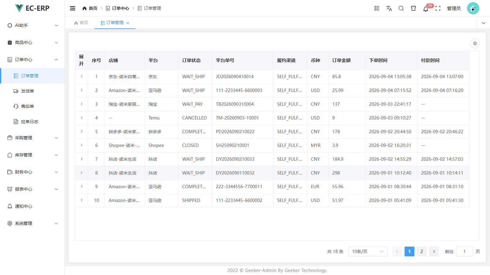
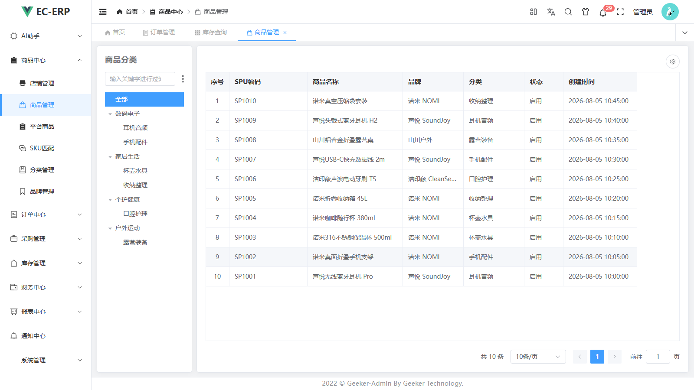
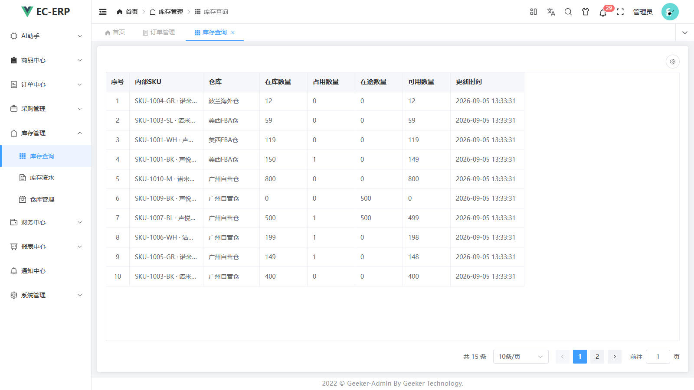
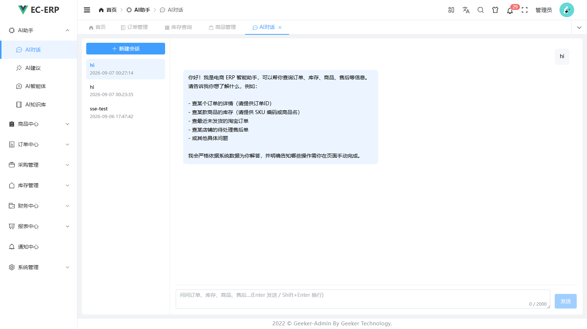
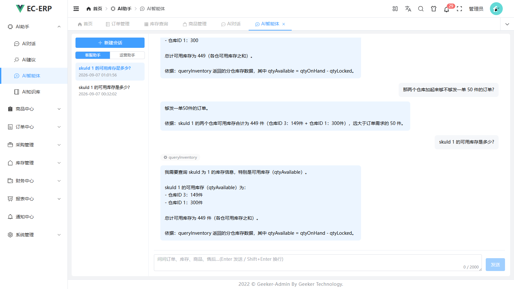

# ec-erp 自研电商 ERP(国内 + 跨境)

一套覆盖「平台授权 → 拉单 → SKU 绑定 → 订单 → 库存 → 采购/仓储 → 发货 → 售后 → 财务结算 → 利润报表」全链路的电商 ERP,国内 7 平台(淘宝/京东/拼多多/抖店等)+ 跨境 7 平台(Amazon/Temu/Shopee 等),并内置 AI 能力层(自然语言查数、补货/异常/文案等工作流、多角色 Agent、RAG 客服知识库)。

模块化单体架构,功能整合自启航(国内链路)、Wimoor(跨境纵深)、OmniTrade(AI 思路),并对标领星/优麦云的商业产品口径。**与五个对标系统的功能矩阵对比与差距分析见 [docs/10-对标差距分析.md](docs/10-对标差距分析.md)**。

## 项目时间线

| 阶段 | 时间 | 核心内容 | 状态 |
|---|---|---|---|
| 一期 | 2026-09-05 ~ 2026-09-06 | 核心业务链路落地:认证 RBAC(#1)、凭证 AES-256-GCM 加密(#2)、OAuth 授权中心、SKU 映射绑定(#5)、订单聚合落库(#4)、库存 FlowOps + 成本账(#7)、采购状态机(#10)、发货 + 回传编排(#11)、售后 8 态状态机(#12)、Amazon SP-API adapter 脱机(#3) | ✅ 已收口 |
| 二期 | 2026-09-06 ~ 2026-09-07 | 前端立项(Geeker-Admin v2 底座 + 25+ 业务页面,#16)、通知三渠道(站内 + Webhook + 邮箱,#14)、配置热更(#18)、库存移动加权成本账(#19③)、财务 V1(结算报告解析 + 利润核算 + 退款勾稽)、锁服务(#13) | ✅ 主体已收口 |
| 三期 | 2026-09-07 ~ 2026-09-08 | AI 能力层主体落地:Chat 双通道(同步 + SSE)、五条工作流(异常检测/补货 V2/采购建议/文案生成/选品)、预警引擎(五规则)、RAG 知识库 V1、AgentScope 双角色 Agent | ✅ 主体已落地 |
| 四期 | 2026-09-08 ~ 2026-09-09 | BI 报表(销售日报/商品分析/趋势分析/利润看板/经营简报/Excel 导出,#20~#23)、对标差距分析(docs/10)、文档重整 | ✅ 已收口 |
| 五期 | 2026-09-09 ~ 2026-09-13 | 补强与横向铺开:AI 第八类报表工具(#6)、周期利润口径+校差(#19/#32)、OSS 对象存储(RustFS,#25)、Docker 一键部署(#28)、RBAC 增强(部门/审计/数据权限店铺轴,#27)、SSE 实时推送、小件五连(毛利率下发 #21/自动拆单 #29/调拨在途 #30/账期到期提醒 #31/HIGH 异常聚合推送)、FBA Shipment V1、SP-API Fulfillment Inbound 客户端(#35)、优先级重整(国内平台先行) + 抖店 adapter 脱机(P0)、发货回传异步化(#11)、前端走查七轮(#26) | ✅ 已收口(真凭证联调挂起) |

> **项目起止**:2026-09-05 启动开发(首次 git 提交),当前(2026-09-14)五期已收口,主线等待外部凭证解卡(抖店 AppKey 资质申请中、Amazon 卖家账号审核中),P0 = 抖店 adapter 真凭证联调。
> 各阶段边界为**功能口径**而非严格时间切割——三期/四期存在并行迭代,二期的通知/配置等功能在一期开发期间即已起步。
> 实施过程与拍板细节见 `docs/devlog/`(根目录近期日志 + archive/ 38 篇归档)。

## 页面预览

| 订单管理(多平台聚合) | 商品管理(分类树 + SPU/SKU) |
|---|---|
|  |  |
| **库存查询(多仓四栏)** | **AI 对话(自然语言查订单/库存/售后)** |
|  |  |
| **AI 智能体(ReAct 多轮工具调用)** | **登录页** |
|  |  |

> 前端基于 Geeker-Admin v2(Apache-2.0)底座:Vue 3.5 + Vite + TS + Element Plus,动态菜单由 RBAC 驱动;截图重生成脚本见 `erp-web/tools/take-screenshots.mjs`。

## 功能总览

| 中心 | 模块 | 核心能力 | 状态 |
|---|---|---|---|
| 平台中心 | erp-shop | 店铺管理、OAuth 授权中心(回调换码/Token 自动刷新)、凭证 AES-256-GCM 加密、拉取日志 | ✅ 已落地 |
| 商品中心 | erp-goods | 商品库(SPU/SKU/分类/品牌)、平台商品同步、**SKU 映射绑定**(自动匹配 + 人工绑定,系统心脏) | ✅ 已落地 |
| 订单中心 | erp-order | 全平台订单聚合落库(upsert 幂等)、状态条件推进、订单明细 | ✅ 已落地 |
| 库存中心 | erp-inventory | 多仓库存(本地/海外/FBA)、库存流水(唯一入口 `InventoryService.change()` 同事务记账)、差异化列语义矩阵、调拨单(占用/在途)、**移动加权成本账随流水推进** | ✅ 已落地 |
| 采购中心 | erp-purchase | 采购单状态机(草稿→审核→部分入库→关闭)、审核占在途、入库核销防超收 | ✅ 已落地 |
| 仓储中心 | erp-warehouse | 仓库档案、出入库、删除引用校验 | ✅ 已落地 |
| 发货中心 | erp-fulfill | 发货单状态机、**建单即占库存**、发货核销/回传平台(AFTER_COMMIT 事件驱动 + 异步化失败补偿重试)、发足判定推进订单、**FBA Shipment V1**(五表/状态机/diff 三态对账) | ✅ 已落地 |
| 售后中心 | erp-aftersale | 售后单 8 态状态机(仅退款/退货退款/换货/补发)、收退件复合事务动账、平台售后同步 | ✅ 已落地 |
| 财务中心 | erp-finance | 平台结算报告解析(V2 报表/勾稽入库)、SKU 级利润核算(移动加权成本)、周期利润口径(#19,一期闭环校差)、头程运费 SKU 分摊(#33)、汇率管理、退款勾稽对账 | ✅ V1 已落地 |
| 报表 BI | erp-report | 销售日报/周报、SKU 汇总排名/日趋势、库存快照、商品分析(单品下钻)、利润看板(SVG 趋势)、经营简报(定时推送)、Excel 导出 | ✅ V1 已落地 |
| 营销中心 | erp-ads | 广告报表(竞品监控/AI 动态定价已删除——2026-09-13 优先级重整) | 🚧 卡广告 API 真凭证 |
| 系统平台 | erp-system | JWT 登录 + RBAC 增强(用户/角色/菜单/字典/部门/审计日志/数据权限店铺轴)、站内通知 + Webhook(钉钉/飞书/企微)+ 邮箱 + SSE 实时推送、系统配置热更(sys_config)、OSS 对象存储(RustFS S3 兼容,凭证走 sys_config) | ✅ 已落地 |
| AI 能力层 | erp-ai | 见下节 | ✅ 三期~五期主体落地 |
| 平台适配 | erp-platform-sdk | 防腐层 SPI(PlatformClient)+ Amazon SP-API 全链路(授权/拉单/商品/售后/结算/回传运单,限流+签名+STS)+ **抖店 adapter**(HMAC-SHA256 签名/Token 刷新/订单/商品/售后/物流回传,默认关)+ SP-API Fulfillment Inbound 客户端(#35,平台中立模型) | ✅ 双 adapter 脱机落地 / 🚧 真凭证联调中(Amazon 审核中、抖店 AppKey 申请中) |

### AI 能力(erp-ai)

| 能力 | 说明 |
|---|---|
| 自然语言查询 | 只读 @Tool 八类(订单/库存/商品/售后/店铺/采购/发货/报表),Chat 双通道(同步 + SSE 流式),会话持久化 + 工具调用审计,消息 markdown 渲染(marked + DOMPurify 净化) |
| 五条工作流 | SAA Graph:补货建议(**(s,S) 策略 V2**:安全库存/采购提前期/服务水平档位)、订单异常检测(两段式:规则先筛 + LLM 批量评分,零可疑单零 LLM 成本)、智能采购建议(供应商聚合 + 预估金额)、Listing 文案批量生成、智能选品(三维加权纯程序评分,可复算);其中采购/文案/选品三条已定时接线(错峰 cron,总开关默认关) |
| 自动拆单建议 | 订单审核事件触发纯规则拆单建议(方案 A,不调 LLM),落建议表人工确认 |
| AI 智能体 | AgentScope ReActAgent 双角色:客服(全量只读工具)/ 运营(库存商品盘面),多轮会话复用聊天持久化,工具零复制桥接 |
| RAG 知识库 | AI 客服 V1:文档上传切块向量化,检索注入上下文;向量不入库(正本可重建),JSON 文件持久化零新基建 |
| 预警引擎 | 低库存/发货超时/退款异常/滞销/积压/账期到期提醒六规则,HIGH 异常跨规则聚合单推,站内/Webhook/邮箱三渠道 |
| 经营简报 | 日/周/月报定时生成,三渠道扇出推送,报表中心可预览 |

所有 AI 产出一律落 `ai_suggestion` 建议表(待确认/已采纳/已忽略),**人工确认闭环,不给 AI 直接写库**;程序取数+程序计算、LLM 只写报告(判断归 AI、执行归程序)。

## 技术栈

JDK 21 · **Spring Boot 4.0.6**(Spring Framework 7)· Spring AI **2.0.1**(GA)· Spring AI Alibaba **2.0.0-M1.1**(Graph 工作流)· AgentScope Java **2.0.2**(GA,多 Agent)· MyBatis-Plus 3.5.17(boot4-starter)· Redisson 4.7.0(分布式锁/限流)· Hutool 5.8.47 · MySQL 9.7.2 LTS(SQL 9.7.2 原生口径,见 TODO"SQL 兼容性红线")· Redis 7 · Vue 3.5 + TS + Element Plus(Geeker-Admin v2 底座)

> 为什么必须 Boot 4.x:Spring AI Alibaba 2.0 与 AgentScope 2.0 都构建在 Spring AI 2.0(Spring Framework 7)之上,而 Spring AI 2.0 要求 Boot 4.x。三者是叠加关系,不是三选一。
> ⚠️ Spring AI Alibaba 2.0 仍为里程碑版(2.0 线无 GA);升级只动根 pom 的三个 version 属性。

## 当前状态与差距(2026-09-13)

**已收口**:RBAC(含部门/审计/数据权限增强)/凭证加密/OAuth 授权、订单/库存(调拨在途)/发货(FBA + 回传异步化)/售后/采购/仓储全链路(单据状态机 + 同事务动账)、财务(结算解析 + 移动加权利润 + 周期口径校差 + 头程分摊 + 退款勾稽)、报表 V1(六类报表 + 导出 + 简报)、AI 主体(八类工具 + 五工作流 + 双角色 Agent + RAG + 六规则预警 + markdown 渲染)、前端 25+ 页面(走查七轮)、通知三渠道 + SSE 实时推送、配置热更、OSS、Docker 一键部署;双 adapter(Amazon + 抖店)脱机落地,抖店单测 141 绿。

**关键差距**(完整分析见 [docs/10](docs/10-对标差距分析.md)):
1. **真凭证联调**——全系统唯一外部依赖:抖店 AppKey 资质申请中(P0,周期 1-4 周)、Amazon Professional 卖家账号审核中(P1);一期闭环验收拆国内/Amazon 双线,先到先跑;
2. **平台覆盖面**——14 平台宣称 vs 2 个 adapter 脱机落地,其余平台随 #24 按手册逐平台铺开;
3. **广告域空白**(erp-ads 休眠)、财务深水区余量(预估费用/收付款,跨期系统性差异按口径不修)、履约待真实代发/海外仓订单流(P3 触发条件挂起)。

**待完成功能与优先级清单见 [TODO.md](TODO.md) 第一节**(P0 阻塞链头 → P1 凭证解卡即动 → P2 无依赖可开工 → P3 拍板挂起)。

复杂逻辑留 `TODO(编号)` 占位,逐项清单见 **[TODO.md](TODO.md)**,建表脚本见 `docs/sql/01_schema_init.sql`。

## 目录结构

```
ec-erp/
├── docs/                 文档(01~06 设计/07·09 规范/08 精读清单/10 对标差距分析/plans 实施计划书(含 archive 归档)/sql 建表脚本/devlog 拍板归档(38 篇)/images 截图,全部随仓库发布)
│   ├── 07-开发规范守则.md / 09-前端开发规范守则.md
│   ├── 10-对标差距分析.md  ← 对标五系统的功能矩阵与差距
│   ├── plans/            实施计划书(未开工/进行中在根,已完成在 archive/)
│   ├── images/           README 页面截图
│   └── sql/01_schema_init.sql
├── erp-common/           通用基础(返回体/异常/分页/领域事件/OSS 对象存储 OssService)
├── erp-contract/         跨域契约接口(只读查询契约 + 动账/存在性/引用计数命令,零实现,收口 erp-api)
├── erp-system/           系统管理(RBAC 增强/字典/通知三渠道 + SSE 实时推送/配置热更)
├── erp-shop/             平台中心(店铺/授权/凭证加密/OAuth 回调/拉取日志)
├── erp-goods/            商品中心(商品库/SKU绑定★)
├── erp-order/            订单中心(统一订单/状态推进/销量日表)
├── erp-inventory/        库存中心(多仓/流水/差异化语义/调拨在途/移动加权成本账/日快照)
├── erp-purchase/         采购中心(状态机/在途管理/入库核销)
├── erp-warehouse/        仓储中心(仓库档案/出入库)
├── erp-fulfill/          发货中心(发货单状态机/占用模型/回传编排异步化 + 失败补偿/FBA Shipment)
├── erp-aftersale/        售后中心(8 态状态机/收退件动账)
├── erp-finance/          财务中心(结算报告/利润核算/周期口径/汇率/退款勾稽)
├── erp-ads/              营销中心(休眠,卡广告 API 凭证)
├── erp-report/           报表 BI(销售/商品分析/利润看板/经营简报/导出)
├── erp-platform-sdk/     平台适配防腐层(SPI + Amazon SP-API + 抖店 adapter)
├── erp-ai/               AI 能力层(tools 八类/chat + markdown 渲染/graph 五工作流/预警六规则/agent/RAG/拆单建议)
├── erp-api/              主应用入口(:8088,跨域编排/契约实现/任务调度/发货回传)
├── erp-worker/           拉单 worker(预留,:8089,当前跑在 erp-api 进程内)
└── erp-codegen/          开发工具(非运行时):CRUD 八件套 + 状态机守卫测试生成器,用法见其 README.md
```

## 快速开始

两条路任选:**Docker 一键**(零本地依赖,新环境首选)或**本地 dev-up 脚本**(复用本机 MySQL/Redis)。密钥准备:

- Docker 路:复制 `.env.example` 为项目根 `.env`(已被 .gitignore 忽略,严禁提交),填 3 个必填键:`MYSQL_ROOT_PASSWORD` / `ERP_JWT_SECRET`(≥32 字节,`openssl rand -hex 32`)/ `ERP_TOKEN_KEY`(32 字节标准 base64,`openssl rand -base64 32`);可选键(AI/Amazon/Webhook)照注释按需填
- 本地路:复制 `local.properties.example` 为 `local.properties`(严禁提交),填 MySQL/Redis 连接与上述两个密钥键;生成值命令同上(Windows PowerShell 生成命令见下「密钥生成」注)

```bash
# ── 路线 A:Docker 一键(需 Docker Engine + Compose v2)──
cp .env.example .env            # 填 3 个必填键(见上)
docker compose --profile web up -d   # mysql+redis+erp-api+web 前端;首次构建较慢
# 浏览器 http://localhost:8080 登录;后端直连 :8088,MySQL/Redis 宿主机端口也已映射
# 重来一遍:docker compose down -v(清卷)后可重来;数据库初始化只挂 docs/sql/01_schema_init.sql 单一正本

# ── 路线 B:本地一键脚本(git-bash / WSL / Linux;需 JDK 21 + mvn + mysql 客户端)──
scripts/dev-up.sh               # 环境检查(密钥/端口,报错含修复示例)→ 建库(幂等)→ 构建 → 前台启动 :8088
scripts/dev-up.sh --with-web    # 额外后台起前端 pnpm dev(:5173)
scripts/dev-up.sh --skip-build --skip-db   # 增量:有 jar 时直接重启
```

登录:默认管理员 admin / admin@123(BCrypt 存储,首次登录后立即改密);全部 /api/** 已纳入 JWT+RBAC 鉴权,用户/角色/菜单管理类接口限 admin 角色。AI 功能(可选):设置 `OPENAI_API_KEY`/`AI_API_KEY` 后生效,无 key 时启动不炸、调用返回友好报错。

> **密钥生成**:Linux/macOS/Git Bash:`openssl rand -base64 32`(ERP_TOKEN_KEY)/ `openssl rand -hex 32`(ERP_JWT_SECRET);Windows PowerShell:`$b=[byte[]]::new(32);[Security.Cryptography.RandomNumberGenerator]::Fill($b);[Convert]::ToBase64String($b)`。换 `ERP_TOKEN_KEY` 后存量密文不可解(店铺需重新授权),请妥善保管。换库重跑:建库正本 `docs/sql/01_schema_init.sql` 幂等(CREATE IF NOT EXISTS + INSERT IGNORE),新库直接执行即可。

环境要求:JDK 21 · MySQL 9.7.2 LTS(mapper XML 自定义 SQL 用 9.7.2 原生形态并须真库验证,见 TODO"SQL 兼容性红线") · Redis 7 · Node ≥22.12 + pnpm 11.8(前端)。

## 开发工具:erp-codegen(CRUD 脚手架生成器)

新业务域标准流程:**表设计(add-table 流程)→ 跑生成器出八件套骨架 → 人工补业务规则(TODO 编号)**。

```bash
# 项目根目录执行;从 docs/sql/01_schema_init.sql 解析指定表,生成 Entity/Mapper/Query/SaveRequest/Response/Service/Controller/单测
mvn -q -pl erp-codegen compile exec:java -Dtable=<表名> -Dmodule=<模块名> -DnameZh=<中文名> [-DtodoId=7] [-Dforce=true]
```

默认存在即跳过(不覆盖手工代码);另有状态机守卫测试生成器,参数与边界详见 `erp-codegen/README.md`。

## 开发约定(详见 docs/07-开发规范守则,基线:《阿里巴巴Java开发手册》)

1. 模块间禁止横向依赖,跨域调用走 erp-contract 契约(实现在 erp-api 编排);
2. adapter 内只做报文翻译,不写业务逻辑;
3. 库存变更走统一入口,同事务写流水;
4. 金额一律 DECIMAL,平台幂等靠 `(shop_id, platform_xxx_id)` 唯一键;
5. 命名/分层/异常日志/事务/数据库/安全/单测/反模式清单,见 docs/07(以阿里巴巴Java开发手册为基线 + 项目铁律),写代码前先读。

包名 `com.own.erp` 可按需全局替换为自己的域名。
